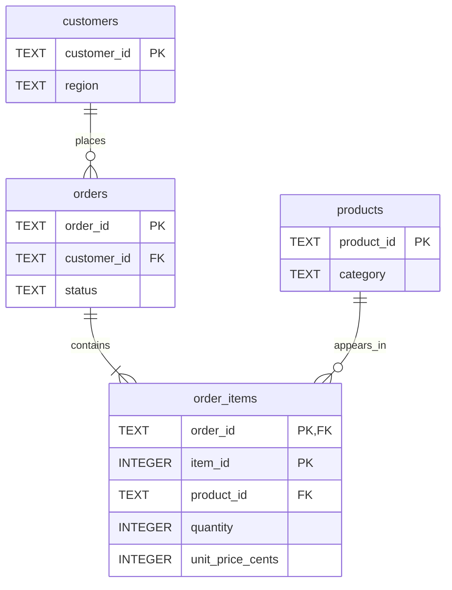

# Input data contract

Each input directory contains these four UTF-8 CSV files. Column order must
match the sample headers. All fields are required except `delivered_at` for
non-delivered orders. Leading and trailing whitespace is stripped.

| File | Grain / key | Fields |
|---|---|---|
| customers.csv | One customer / customer_id | customer_id, region |
| products.csv | One product / product_id | product_id, category |
| orders.csv | One order / order_id | order_id, customer_id, status, ordered_at, estimated_delivery_at, delivered_at |
| order_items.csv | One order line / (order_id, item_id) | order_id, item_id, product_id, quantity, unit_price_cents |

- IDs are nonempty strings, except `item_id`, which is a positive integer.
- Use a stable customer identifier across purchases, not an order-specific account ID.
- `quantity` is a positive integer; `unit_price_cents` is a nonnegative integer.
- All money must use the same currency, with 100 minor units per major unit.
- Dates use `YYYY-MM-DD`. Time-of-day and timezone analysis are out of scope.
- Supported statuses: `delivered`, `shipped`, `cancelled`.
- Delivered orders require a delivery date; other statuses require it to be blank.
- Estimated and actual delivery dates cannot precede the order date.
- Every order must have at least one item, including cancelled and shipped orders.
- Foreign keys must resolve; duplicate keys are rejected, not deduplicated silently.
- Every file must have at least one data row. Empty analysis populations still
  produce report headers, and rates with no denominator are null.

The sample contains four customers, three products, six orders, and seven
order lines. Regions and amounts are fictional and deliberately small enough
to verify manually. Never present this fixture as Malaysian market data.

For a source with additional statuses or timestamp fields, create an explicit
adapter with documented mappings rather than discarding unsupported records.

## Table relationships

The diagram highlights keys and analysis fields; the table above lists every
input column. Customers and products can exist without orders or items.
Every order must have at least one item: the loader checks this rule after
insertion, while SQLite foreign keys enforce the references.

## Choosing the correct row level

Use `order_summary` for order counts, average order value, and delivery
metrics. It aggregates item values before joining them to orders, leaving
one row per order.

Use `order_items` joined to `products` for category and unit analysis.
The item key is the pair `(order_id, item_id)`; `item_id` alone is not unique
across orders.

For example, an order containing two item rows becomes two rows when joined
directly to `order_items`. Counting those joined rows would count the order
twice. A distinct order count fixes that count, but averaging delivery days
over the joined rows still overweights orders with more items. Calculate
delivery averages from `order_summary` instead.

Source of truth: [the SQL schema](../sql/schema.sql).
